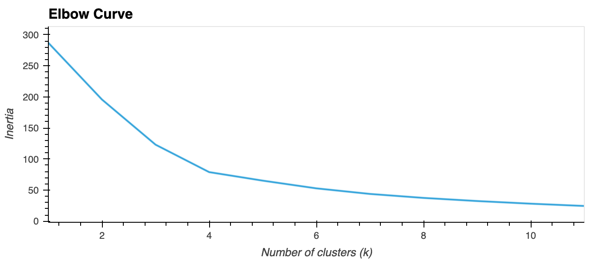

# Crypto Clustering
This challenge utilizes Python and unsupervised learning to predict if cryptocurrencies are affected by 24-hour or 7-day price changes.

## Results

#### Elbow Curve
##### Original Data

##### Transformed Data

#### Clustering
##### Original Data

##### Transformed Data

## Analysis
**1.** What is the best value for k?
* **4** 

**2.** What is the total explained variance of the three principal components?
* **89%**

**3.** What is the best value for k when using the PCA data? Does it differ from the best k value found using the original data?
* **4**
* PCA data, visually, follows a very similar elbow curve to the original data, best value for K-Means remains consistent between the transformed and original data.

**4.** After visually analyzing the cluster analysis results, what is the impact of using fewer features to cluster the data using K-Means?
* The main impact visually, seems to be higher quality clustering (transformed clusters are visually more compact and well-separated, compared to the original data scatter plot). Outliers are also more obvious with the transformed data. 
* Ultimately leads to more informed and accurate interpretations of the results.

### Resources
* [Introduction to K-Means Clustering Algorithm](https://www.analyticsvidhya.com/blog/2019/08/comprehensive-guide-k-means-clustering/)
* [sklearn KMeans Documentation](https://scikit-learn.org/stable/modules/generated/sklearn.cluster.KMeans)
